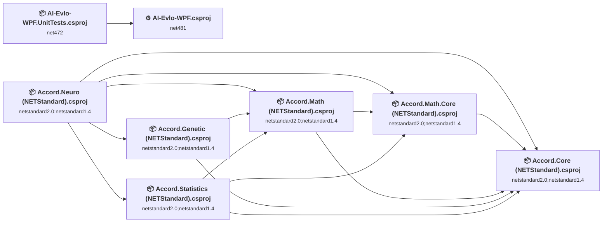
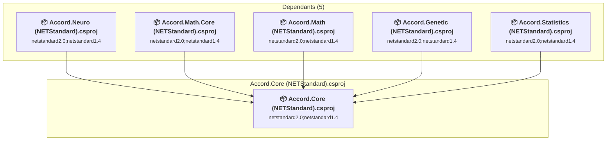
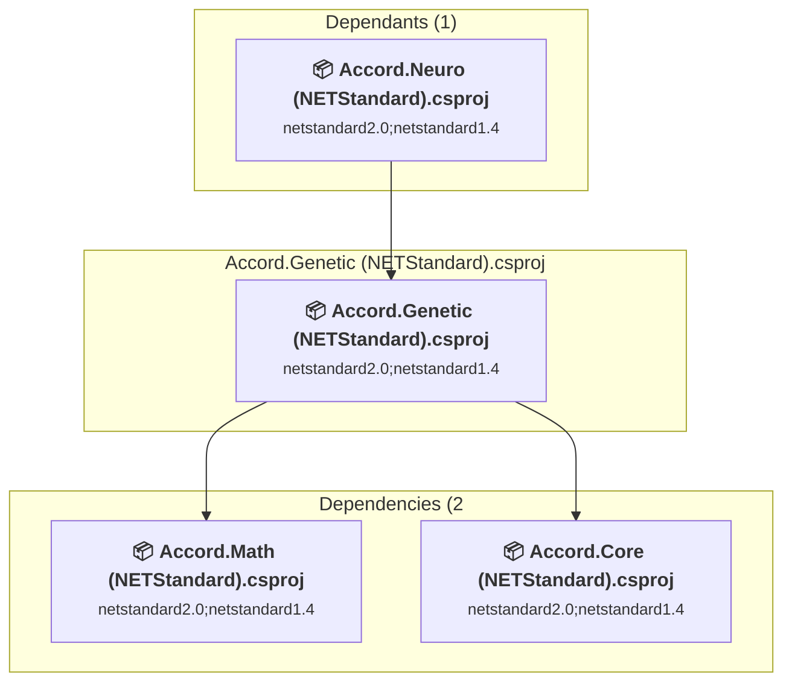
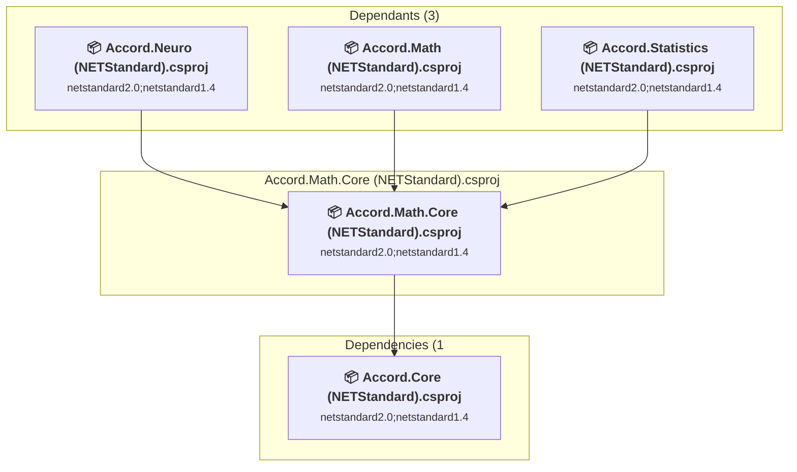
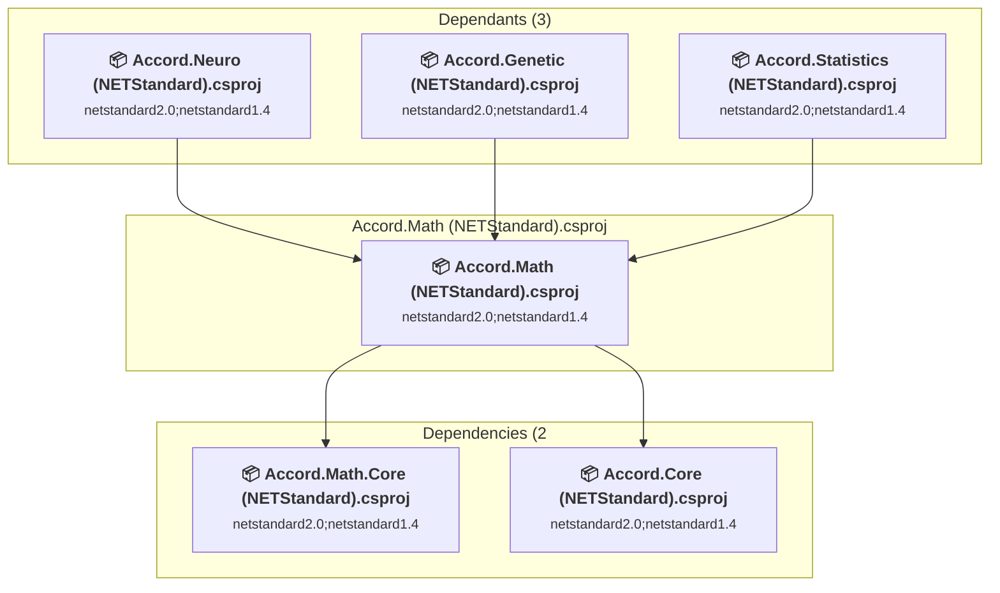
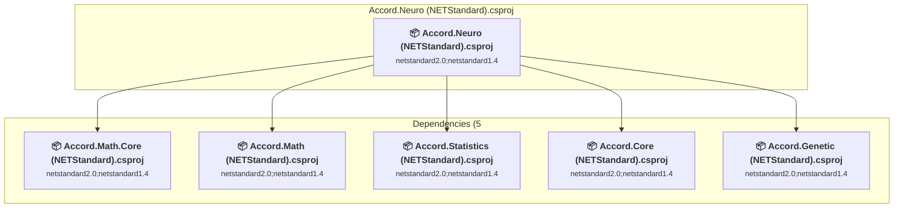
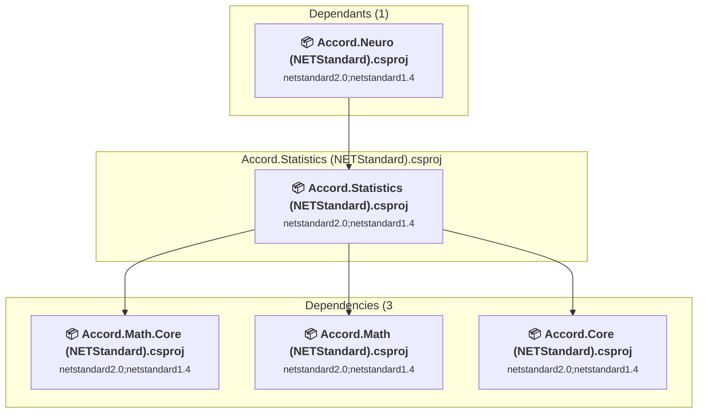
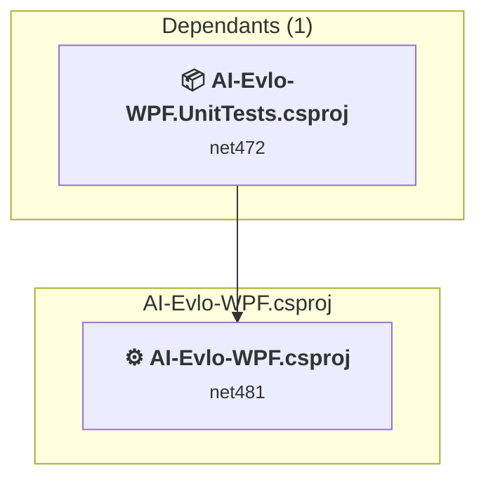
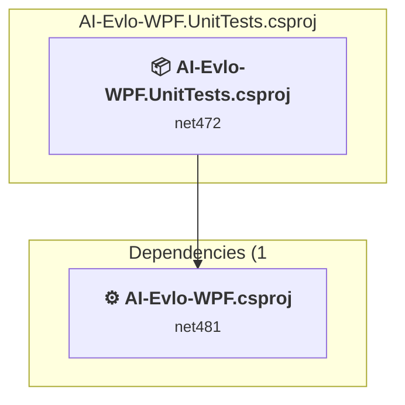

# Projects and dependencies analysis

This document provides a comprehensive overview of the projects and their dependencies in the context of upgrading to .NETCoreApp,Version=v10.0.

## Table of Contents

- [Executive Summary](#executive-Summary)
  - [Highlevel Metrics](#highlevel-metrics)
  - [Projects Compatibility](#projects-compatibility)
  - [Package Compatibility](#package-compatibility)
  - [API Compatibility](#api-compatibility)
- [Aggregate NuGet packages details](#aggregate-nuget-packages-details)
- [Top API Migration Challenges](#top-api-migration-challenges)
  - [Technologies and Features](#technologies-and-features)
  - [Most Frequent API Issues](#most-frequent-api-issues)
- [Projects Relationship Graph](#projects-relationship-graph)
- [Project Details](#project-details)

  - [Accord.NET-3.8.0\Accord.Core\Accord.Core (NETStandard).csproj](#accordnet-380accordcoreaccordcore-(netstandard)csproj)
  - [Accord.NET-3.8.0\Accord.Genetic\Accord.Genetic (NETStandard).csproj](#accordnet-380accordgeneticaccordgenetic-(netstandard)csproj)
  - [Accord.NET-3.8.0\Accord.Math.Core\Accord.Math.Core (NETStandard).csproj](#accordnet-380accordmathcoreaccordmathcore-(netstandard)csproj)
  - [Accord.NET-3.8.0\Accord.Math\Accord.Math (NETStandard).csproj](#accordnet-380accordmathaccordmath-(netstandard)csproj)
  - [Accord.NET-3.8.0\Accord.Neuro\Accord.Neuro (NETStandard).csproj](#accordnet-380accordneuroaccordneuro-(netstandard)csproj)
  - [Accord.NET-3.8.0\Accord.Statistics\Accord.Statistics (NETStandard).csproj](#accordnet-380accordstatisticsaccordstatistics-(netstandard)csproj)
  - [AI-Evlo-Test\AI-Evlo-WPF.csproj](#ai-evlo-testai-evlo-wpfcsproj)
  - [AI-Evlo-WPF.UnitTests\AI-Evlo-WPF.UnitTests.csproj](#ai-evlo-wpfunittestsai-evlo-wpfunittestscsproj)

## Executive Summary

### Highlevel Metrics

| Metric | Count | Status |
| :--- | :---: | :--- |
| Total Projects | 8 | All require upgrade |
| Total NuGet Packages | 10 | 2 need upgrade |
| Total Code Files | 996 |  |
| Total Code Files with Incidents | 57 |  |
| Total Lines of Code | 825473 |  |
| Total Number of Issues | 3016 |  |
| Estimated LOC to modify | 3000+ | at least 0.4% of codebase |

### Projects Compatibility

| Project | Target Framework | Difficulty | Package Issues | API Issues | Est. LOC Impact | Description |
| :--- | :---: | :---: | :---: | :---: | :---: | :--- |
| [Accord.NET-3.8.0\Accord.Core\Accord.Core (NETStandard).csproj](#accordnet-380accordcoreaccordcore-(netstandard)csproj) | netstandard2.0;netstandard1.4 | 🟢 Low | 1 | 37 | 37+ | ClassLibrary, Sdk Style = True |
| [Accord.NET-3.8.0\Accord.Genetic\Accord.Genetic (NETStandard).csproj](#accordnet-380accordgeneticaccordgenetic-(netstandard)csproj) | netstandard2.0;netstandard1.4 | 🟢 Low | 0 | 0 |  | ClassLibrary, Sdk Style = True |
| [Accord.NET-3.8.0\Accord.Math.Core\Accord.Math.Core (NETStandard).csproj](#accordnet-380accordmathcoreaccordmathcore-(netstandard)csproj) | netstandard2.0;netstandard1.4 | 🟢 Low | 0 | 0 |  | ClassLibrary, Sdk Style = True |
| [Accord.NET-3.8.0\Accord.Math\Accord.Math (NETStandard).csproj](#accordnet-380accordmathaccordmath-(netstandard)csproj) | netstandard2.0;netstandard1.4 | 🟢 Low | 2 | 5 | 5+ | ClassLibrary, Sdk Style = True |
| [Accord.NET-3.8.0\Accord.Neuro\Accord.Neuro (NETStandard).csproj](#accordnet-380accordneuroaccordneuro-(netstandard)csproj) | netstandard2.0;netstandard1.4 | 🟢 Low | 0 | 0 |  | ClassLibrary, Sdk Style = True |
| [Accord.NET-3.8.0\Accord.Statistics\Accord.Statistics (NETStandard).csproj](#accordnet-380accordstatisticsaccordstatistics-(netstandard)csproj) | netstandard2.0;netstandard1.4 | 🟢 Low | 1 | 12 | 12+ | ClassLibrary, Sdk Style = True |
| [AI-Evlo-Test\AI-Evlo-WPF.csproj](#ai-evlo-testai-evlo-wpfcsproj) | net481 | 🟡 Medium | 2 | 2364 | 2364+ | ClassicWinForms, Sdk Style = False |
| [AI-Evlo-WPF.UnitTests\AI-Evlo-WPF.UnitTests.csproj](#ai-evlo-wpfunittestsai-evlo-wpfunittestscsproj) | net472 | 🟡 Medium | 1 | 582 | 582+ | WinForms, Sdk Style = True |

### Package Compatibility

| Status | Count | Percentage |
| :--- | :---: | :---: |
| ✅ Compatible | 8 | 80.0% |
| ⚠️ Incompatible | 2 | 20.0% |
| 🔄 Upgrade Recommended | 0 | 0.0% |
| ***Total NuGet Packages*** | ***10*** | ***100%*** |

### API Compatibility

| Category | Count | Impact |
| :--- | :---: | :--- |
| 🔴 Binary Incompatible | 2926 | High - Require code changes |
| 🟡 Source Incompatible | 60 | Medium - Needs re-compilation and potential conflicting API error fixing |
| 🔵 Behavioral change | 14 | Low - Behavioral changes that may require testing at runtime |
| ✅ Compatible | 441487 |  |
| ***Total APIs Analyzed*** | ***444487*** |  |

## Aggregate NuGet packages details

| Package | Current Version | Suggested Version | Projects | Description |
| :--- | :---: | :---: | :--- | :--- |
| Avapi | 1.4.8.3 |  | [AI-Evlo-WPF.UnitTests.csproj](#ai-evlo-wpfunittestsai-evlo-wpfunittestscsproj) | ✅Compatible |
| Moq | 4.20.72 |  | [AI-Evlo-WPF.UnitTests.csproj](#ai-evlo-wpfunittestsai-evlo-wpfunittestscsproj) | ✅Compatible |
| MSTest | 4.0.2 |  | [AI-Evlo-WPF.UnitTests.csproj](#ai-evlo-wpfunittestsai-evlo-wpfunittestscsproj) | ✅Compatible |
| NETStandard.Library | 2.0.3 |  | [Accord.Core (NETStandard).csproj](#accordnet-380accordcoreaccordcore-(netstandard)csproj) [Accord.Genetic (NETStandard).csproj](#accordnet-380accordgeneticaccordgenetic-(netstandard)csproj) [Accord.Math (NETStandard).csproj](#accordnet-380accordmathaccordmath-(netstandard)csproj) [Accord.Math.Core (NETStandard).csproj](#accordnet-380accordmathcoreaccordmathcore-(netstandard)csproj) [Accord.Neuro (NETStandard).csproj](#accordnet-380accordneuroaccordneuro-(netstandard)csproj) [Accord.Statistics (NETStandard).csproj](#accordnet-380accordstatisticsaccordstatistics-(netstandard)csproj) | ✅Compatible |
| NeuralNetwork | 7.4.0 |  | [AI-Evlo-WPF.csproj](#ai-evlo-testai-evlo-wpfcsproj) [AI-Evlo-WPF.UnitTests.csproj](#ai-evlo-wpfunittestsai-evlo-wpfunittestscsproj) | ⚠️NuGet package is incompatible |
| NeuralNetworkVisualizer | 1.2.0 |  | [AI-Evlo-WPF.csproj](#ai-evlo-testai-evlo-wpfcsproj) | ⚠️NuGet package is incompatible |
| Newtonsoft.Json | 13.0.4 |  | [AI-Evlo-WPF.csproj](#ai-evlo-testai-evlo-wpfcsproj) | ✅Compatible |
| System.ComponentModel.Annotations | 5.0.0 |  | [Accord.Core (NETStandard).csproj](#accordnet-380accordcoreaccordcore-(netstandard)csproj) [Accord.Statistics (NETStandard).csproj](#accordnet-380accordstatisticsaccordstatistics-(netstandard)csproj) | NuGet package functionality is included with framework reference |
| System.Threading.Tasks | 4.3.0 |  | [Accord.Math (NETStandard).csproj](#accordnet-380accordmathaccordmath-(netstandard)csproj) | NuGet package functionality is included with framework reference |
| System.Threading.Thread | 4.3.0 |  | [Accord.Math (NETStandard).csproj](#accordnet-380accordmathaccordmath-(netstandard)csproj) | NuGet package functionality is included with framework reference |

## Top API Migration Challenges

### Technologies and Features

| Technology | Issues | Percentage | Migration Path |
| :--- | :---: | :---: | :--- |
| WPF (Windows Presentation Foundation) | 1151 | 38.4% | WPF APIs for building Windows desktop applications with XAML-based UI that are available in .NET on Windows. WPF provides rich desktop UI capabilities with data binding and styling. Enable Windows Desktop support: Option 1 (Recommended): Target net9.0-windows; Option 2: Add <UseWindowsDesktop>true</UseWindowsDesktop>. |
| Windows Forms | 594 | 19.8% | Windows Forms APIs for building Windows desktop applications with traditional Forms-based UI that are available in .NET on Windows. Enable Windows Desktop support: Option 1 (Recommended): Target net9.0-windows; Option 2: Add <UseWindowsDesktop>true</UseWindowsDesktop>; Option 3 (Legacy): Use Microsoft.NET.Sdk.WindowsDesktop SDK. |
| Windows Forms Legacy Controls | 254 | 8.5% | Legacy Windows Forms controls that have been removed from .NET Core/5+ including StatusBar, DataGrid, ContextMenu, MainMenu, MenuItem, and ToolBar. These controls were replaced by more modern alternatives. Use ToolStrip, MenuStrip, ContextMenuStrip, and DataGridView instead. |
| Deprecated Remoting & Serialization | 17 | 0.6% | Legacy .NET Remoting, BinaryFormatter, and related serialization APIs that are deprecated and removed for security reasons. Remoting provided distributed object communication but had significant security vulnerabilities. Migrate to gRPC, HTTP APIs, or modern serialization (System.Text.Json, protobuf). |
| GDI+ / System.Drawing | 5 | 0.2% | System.Drawing APIs for 2D graphics, imaging, and printing that are available via NuGet package System.Drawing.Common. Note: Not recommended for server scenarios due to Windows dependencies; consider cross-platform alternatives like SkiaSharp or ImageSharp for new code. |
| Legacy Configuration System | 2 | 0.1% | Legacy XML-based configuration system (app.config/web.config) that has been replaced by a more flexible configuration model in .NET Core. The old system was rigid and XML-based. Migrate to Microsoft.Extensions.Configuration with JSON/environment variables; use System.Configuration.ConfigurationManager NuGet package as interim bridge if needed. |
| Code Access Security (CAS) | 1 | 0.0% | Code Access Security (CAS) APIs that were removed in .NET Core/.NET for security and performance reasons. CAS provided fine-grained security policies but proved complex and ineffective. Remove CAS usage; not supported in modern .NET. |

### Most Frequent API Issues

| API | Count | Percentage | Category |
| :--- | :---: | :---: | :--- |
| T:System.Windows.Point | 343 | 11.4% | Binary Incompatible |
| M:System.Windows.Point.#ctor(System.Double,System.Double) | 124 | 4.1% | Binary Incompatible |
| T:System.Windows.Controls.Canvas | 118 | 3.9% | Binary Incompatible |
| T:System.Windows.FrameworkElement | 117 | 3.9% | Binary Incompatible |
| T:System.Windows.Forms.DataGridViewTextBoxColumn | 91 | 3.0% | Binary Incompatible |
| T:System.Windows.Vector | 75 | 2.5% | Binary Incompatible |
| T:System.Windows.Visibility | 63 | 2.1% | Binary Incompatible |
| T:System.Windows.Media.ImageSource | 57 | 1.9% | Binary Incompatible |
| T:System.Windows.Media.Brush | 52 | 1.7% | Binary Incompatible |
| T:System.Windows.Forms.DataGridView | 50 | 1.7% | Binary Incompatible |
| T:System.Windows.Controls.UIElementCollection | 49 | 1.6% | Binary Incompatible |
| P:System.Windows.Controls.Panel.Children | 49 | 1.6% | Binary Incompatible |
| T:System.Windows.Controls.ComboBox | 49 | 1.6% | Binary Incompatible |
| T:System.Windows.Media.SolidColorBrush | 44 | 1.5% | Binary Incompatible |
| P:System.Windows.Point.X | 40 | 1.3% | Binary Incompatible |
| P:System.Windows.Point.Y | 39 | 1.3% | Binary Incompatible |
| T:System.Windows.Forms.Button | 34 | 1.1% | Binary Incompatible |
| T:System.Windows.Media.Color | 30 | 1.0% | Binary Incompatible |
| T:System.Windows.Controls.Button | 29 | 1.0% | Binary Incompatible |
| T:System.Windows.Controls.TextBlock | 28 | 0.9% | Binary Incompatible |
| T:System.Windows.RoutedEventHandler | 26 | 0.9% | Binary Incompatible |
| T:System.Windows.Forms.AnchorStyles | 25 | 0.8% | Binary Incompatible |
| P:System.Windows.UIElement.Visibility | 21 | 0.7% | Binary Incompatible |
| M:System.Windows.Point.Subtract(System.Windows.Point,System.Windows.Point) | 20 | 0.7% | Binary Incompatible |
| T:System.Windows.Controls.Label | 20 | 0.7% | Binary Incompatible |
| M:System.Windows.Controls.UIElementCollection.Add(System.Windows.UIElement) | 19 | 0.6% | Binary Incompatible |
| P:System.Windows.FrameworkElement.Width | 19 | 0.6% | Binary Incompatible |
| T:System.Windows.Input.MouseButtonEventHandler | 18 | 0.6% | Binary Incompatible |
| T:System.Runtime.Serialization.Formatters.Binary.BinaryFormatter | 17 | 0.6% | Source Incompatible |
| T:System.Windows.Forms.StatusStrip | 17 | 0.6% | Binary Incompatible |
| M:System.Exception.#ctor(System.Runtime.Serialization.SerializationInfo,System.Runtime.Serialization.StreamingContext) | 16 | 0.5% | Source Incompatible |
| P:System.Windows.FrameworkElement.Height | 16 | 0.5% | Binary Incompatible |
| P:System.Windows.Controls.TextBlock.Text | 16 | 0.5% | Binary Incompatible |
| T:System.Windows.Media.Brushes | 16 | 0.5% | Binary Incompatible |
| P:System.Windows.Vector.Length | 15 | 0.5% | Binary Incompatible |
| P:System.Windows.Controls.ContentControl.Content | 15 | 0.5% | Binary Incompatible |
| T:System.Windows.VerticalAlignment | 15 | 0.5% | Binary Incompatible |
| T:System.Windows.Controls.Image | 15 | 0.5% | Binary Incompatible |
| P:System.Windows.FrameworkElement.ActualHeight | 15 | 0.5% | Binary Incompatible |
| P:System.Windows.FrameworkElement.ActualWidth | 15 | 0.5% | Binary Incompatible |
| T:System.Windows.Shapes.Line | 14 | 0.5% | Binary Incompatible |
| T:System.Windows.Thickness | 14 | 0.5% | Binary Incompatible |
| T:System.Windows.Controls.TextBox | 14 | 0.5% | Binary Incompatible |
| T:System.Windows.Forms.BindingSource | 14 | 0.5% | Binary Incompatible |
| F:System.Windows.Visibility.Collapsed | 13 | 0.4% | Binary Incompatible |
| T:System.Windows.Forms.CheckBox | 13 | 0.4% | Binary Incompatible |
| P:System.Windows.Controls.Image.Source | 13 | 0.4% | Binary Incompatible |
| T:System.Windows.Forms.Timer | 12 | 0.4% | Binary Incompatible |
| T:System.Windows.Forms.Padding | 12 | 0.4% | Binary Incompatible |
| T:System.Windows.Threading.DispatcherTimer | 12 | 0.4% | Binary Incompatible |

## Projects Relationship Graph

Legend:
📦 SDK-style project
⚙️ Classic project

## Project Details

### Accord.NET-3.8.0\Accord.Core\Accord.Core (NETStandard).csproj

#### Project Info

- **Current Target Framework:** netstandard2.0;netstandard1.4
- **Proposed Target Framework:** netstandard2.0;netstandard1.4;net10.0
- **SDK-style**: True
- **Project Kind:** ClassLibrary
- **Dependencies**: 0
- **Dependants**: 5
- **Number of Files**: 99
- **Number of Files with Incidents**: 10
- **Lines of Code**: 20321
- **Estimated LOC to modify**: 37+ (at least 0.2% of the project)

#### Dependency Graph

Legend:
📦 SDK-style project
⚙️ Classic project

### API Compatibility

| Category | Count | Impact |
| :--- | :---: | :--- |
| 🔴 Binary Incompatible | 0 | High - Require code changes |
| 🟡 Source Incompatible | 37 | Medium - Needs re-compilation and potential conflicting API error fixing |
| 🔵 Behavioral change | 0 | Low - Behavioral changes that may require testing at runtime |
| ✅ Compatible | 9021 |  |
| ***Total APIs Analyzed*** | ***9058*** |  |

#### Project Technologies and Features

| Technology | Issues | Percentage | Migration Path |
| :--- | :---: | :---: | :--- |
| Deprecated Remoting & Serialization | 5 | 13.5% | Legacy .NET Remoting, BinaryFormatter, and related serialization APIs that are deprecated and removed for security reasons. Remoting provided distributed object communication but had significant security vulnerabilities. Migrate to gRPC, HTTP APIs, or modern serialization (System.Text.Json, protobuf). |

### Accord.NET-3.8.0\Accord.Genetic\Accord.Genetic (NETStandard).csproj

#### Project Info

- **Current Target Framework:** netstandard2.0;netstandard1.4
- **Proposed Target Framework:** netstandard2.0;netstandard1.4;net10.0
- **SDK-style**: True
- **Project Kind:** ClassLibrary
- **Dependencies**: 2
- **Dependants**: 1
- **Number of Files**: 22
- **Number of Files with Incidents**: 1
- **Lines of Code**: 4693
- **Estimated LOC to modify**: 0+ (at least 0.0% of the project)

#### Dependency Graph

Legend:
📦 SDK-style project
⚙️ Classic project

### API Compatibility

| Category | Count | Impact |
| :--- | :---: | :--- |
| 🔴 Binary Incompatible | 0 | High - Require code changes |
| 🟡 Source Incompatible | 0 | Medium - Needs re-compilation and potential conflicting API error fixing |
| 🔵 Behavioral change | 0 | Low - Behavioral changes that may require testing at runtime |
| ✅ Compatible | 3079 |  |
| ***Total APIs Analyzed*** | ***3079*** |  |

### Accord.NET-3.8.0\Accord.Math.Core\Accord.Math.Core (NETStandard).csproj

#### Project Info

- **Current Target Framework:** netstandard2.0;netstandard1.4
- **Proposed Target Framework:** netstandard2.0;netstandard1.4;net10.0
- **SDK-style**: True
- **Project Kind:** ClassLibrary
- **Dependencies**: 1
- **Dependants**: 3
- **Number of Files**: 8
- **Number of Files with Incidents**: 1
- **Lines of Code**: 263059
- **Estimated LOC to modify**: 0+ (at least 0.0% of the project)

#### Dependency Graph

Legend:
📦 SDK-style project
⚙️ Classic project

### API Compatibility

| Category | Count | Impact |
| :--- | :---: | :--- |
| 🔴 Binary Incompatible | 0 | High - Require code changes |
| 🟡 Source Incompatible | 0 | Medium - Needs re-compilation and potential conflicting API error fixing |
| 🔵 Behavioral change | 0 | Low - Behavioral changes that may require testing at runtime |
| ✅ Compatible | 106155 |  |
| ***Total APIs Analyzed*** | ***106155*** |  |

### Accord.NET-3.8.0\Accord.Math\Accord.Math (NETStandard).csproj

#### Project Info

- **Current Target Framework:** netstandard2.0;netstandard1.4
- **Proposed Target Framework:** netstandard2.0;netstandard1.4;net10.0
- **SDK-style**: True
- **Project Kind:** ClassLibrary
- **Dependencies**: 2
- **Dependants**: 3
- **Number of Files**: 303
- **Number of Files with Incidents**: 3
- **Lines of Code**: 371330
- **Estimated LOC to modify**: 5+ (at least 0.0% of the project)

#### Dependency Graph

Legend:
📦 SDK-style project
⚙️ Classic project

### API Compatibility

| Category | Count | Impact |
| :--- | :---: | :--- |
| 🔴 Binary Incompatible | 0 | High - Require code changes |
| 🟡 Source Incompatible | 4 | Medium - Needs re-compilation and potential conflicting API error fixing |
| 🔵 Behavioral change | 1 | Low - Behavioral changes that may require testing at runtime |
| ✅ Compatible | 211428 |  |
| ***Total APIs Analyzed*** | ***211433*** |  |

#### Project Technologies and Features

| Technology | Issues | Percentage | Migration Path |
| :--- | :---: | :---: | :--- |
| Code Access Security (CAS) | 1 | 20.0% | Code Access Security (CAS) APIs that were removed in .NET Core/.NET for security and performance reasons. CAS provided fine-grained security policies but proved complex and ineffective. Remove CAS usage; not supported in modern .NET. |

### Accord.NET-3.8.0\Accord.Neuro\Accord.Neuro (NETStandard).csproj

#### Project Info

- **Current Target Framework:** netstandard2.0;netstandard1.4
- **Proposed Target Framework:** netstandard2.0;netstandard1.4;net10.0
- **SDK-style**: True
- **Project Kind:** ClassLibrary
- **Dependencies**: 5
- **Dependants**: 0
- **Number of Files**: 42
- **Number of Files with Incidents**: 1
- **Lines of Code**: 9072
- **Estimated LOC to modify**: 0+ (at least 0.0% of the project)

#### Dependency Graph

Legend:
📦 SDK-style project
⚙️ Classic project

### API Compatibility

| Category | Count | Impact |
| :--- | :---: | :--- |
| 🔴 Binary Incompatible | 0 | High - Require code changes |
| 🟡 Source Incompatible | 0 | Medium - Needs re-compilation and potential conflicting API error fixing |
| 🔵 Behavioral change | 0 | Low - Behavioral changes that may require testing at runtime |
| ✅ Compatible | 5756 |  |
| ***Total APIs Analyzed*** | ***5756*** |  |

### Accord.NET-3.8.0\Accord.Statistics\Accord.Statistics (NETStandard).csproj

#### Project Info

- **Current Target Framework:** netstandard2.0;netstandard1.4
- **Proposed Target Framework:** netstandard2.0;netstandard1.4;net10.0
- **SDK-style**: True
- **Project Kind:** ClassLibrary
- **Dependencies**: 3
- **Dependants**: 1
- **Number of Files**: 477
- **Number of Files with Incidents**: 7
- **Lines of Code**: 146729
- **Estimated LOC to modify**: 12+ (at least 0.0% of the project)

#### Dependency Graph

Legend:
📦 SDK-style project
⚙️ Classic project

### API Compatibility

| Category | Count | Impact |
| :--- | :---: | :--- |
| 🔴 Binary Incompatible | 0 | High - Require code changes |
| 🟡 Source Incompatible | 12 | Medium - Needs re-compilation and potential conflicting API error fixing |
| 🔵 Behavioral change | 0 | Low - Behavioral changes that may require testing at runtime |
| ✅ Compatible | 93178 |  |
| ***Total APIs Analyzed*** | ***93190*** |  |

#### Project Technologies and Features

| Technology | Issues | Percentage | Migration Path |
| :--- | :---: | :---: | :--- |
| Deprecated Remoting & Serialization | 12 | 100.0% | Legacy .NET Remoting, BinaryFormatter, and related serialization APIs that are deprecated and removed for security reasons. Remoting provided distributed object communication but had significant security vulnerabilities. Migrate to gRPC, HTTP APIs, or modern serialization (System.Text.Json, protobuf). |

### AI-Evlo-Test\AI-Evlo-WPF.csproj

#### Project Info

- **Current Target Framework:** net481
- **Proposed Target Framework:** net10.0-windows
- **SDK-style**: False
- **Project Kind:** ClassicWinForms
- **Dependencies**: 0
- **Dependants**: 1
- **Number of Files**: 40
- **Number of Files with Incidents**: 28
- **Lines of Code**: 6051
- **Estimated LOC to modify**: 2364+ (at least 39.1% of the project)

#### Dependency Graph

Legend:
📦 SDK-style project
⚙️ Classic project

### API Compatibility

| Category | Count | Impact |
| :--- | :---: | :--- |
| 🔴 Binary Incompatible | 2344 | High - Require code changes |
| 🟡 Source Incompatible | 7 | Medium - Needs re-compilation and potential conflicting API error fixing |
| 🔵 Behavioral change | 13 | Low - Behavioral changes that may require testing at runtime |
| ✅ Compatible | 8460 |  |
| ***Total APIs Analyzed*** | ***10824*** |  |

#### Project Technologies and Features

| Technology | Issues | Percentage | Migration Path |
| :--- | :---: | :---: | :--- |
| Legacy Configuration System | 2 | 0.1% | Legacy XML-based configuration system (app.config/web.config) that has been replaced by a more flexible configuration model in .NET Core. The old system was rigid and XML-based. Migrate to Microsoft.Extensions.Configuration with JSON/environment variables; use System.Configuration.ConfigurationManager NuGet package as interim bridge if needed. |
| GDI+ / System.Drawing | 5 | 0.2% | System.Drawing APIs for 2D graphics, imaging, and printing that are available via NuGet package System.Drawing.Common. Note: Not recommended for server scenarios due to Windows dependencies; consider cross-platform alternatives like SkiaSharp or ImageSharp for new code. |
| WPF (Windows Presentation Foundation) | 1021 | 43.2% | WPF APIs for building Windows desktop applications with XAML-based UI that are available in .NET on Windows. WPF provides rich desktop UI capabilities with data binding and styling. Enable Windows Desktop support: Option 1 (Recommended): Target net9.0-windows; Option 2: Add <UseWindowsDesktop>true</UseWindowsDesktop>. |
| Windows Forms Legacy Controls | 254 | 10.7% | Legacy Windows Forms controls that have been removed from .NET Core/5+ including StatusBar, DataGrid, ContextMenu, MainMenu, MenuItem, and ToolBar. These controls were replaced by more modern alternatives. Use ToolStrip, MenuStrip, ContextMenuStrip, and DataGridView instead. |
| Windows Forms | 594 | 25.1% | Windows Forms APIs for building Windows desktop applications with traditional Forms-based UI that are available in .NET on Windows. Enable Windows Desktop support: Option 1 (Recommended): Target net9.0-windows; Option 2: Add <UseWindowsDesktop>true</UseWindowsDesktop>; Option 3 (Legacy): Use Microsoft.NET.Sdk.WindowsDesktop SDK. |

### AI-Evlo-WPF.UnitTests\AI-Evlo-WPF.UnitTests.csproj

#### Project Info

- **Current Target Framework:** net472
- **Proposed Target Framework:** net10.0-windows
- **SDK-style**: True
- **Project Kind:** WinForms
- **Dependencies**: 1
- **Dependants**: 0
- **Number of Files**: 10
- **Number of Files with Incidents**: 6
- **Lines of Code**: 4218
- **Estimated LOC to modify**: 582+ (at least 13.8% of the project)

#### Dependency Graph

Legend:
📦 SDK-style project
⚙️ Classic project

### API Compatibility

| Category | Count | Impact |
| :--- | :---: | :--- |
| 🔴 Binary Incompatible | 582 | High - Require code changes |
| 🟡 Source Incompatible | 0 | Medium - Needs re-compilation and potential conflicting API error fixing |
| 🔵 Behavioral change | 0 | Low - Behavioral changes that may require testing at runtime |
| ✅ Compatible | 4410 |  |
| ***Total APIs Analyzed*** | ***4992*** |  |

#### Project Technologies and Features

| Technology | Issues | Percentage | Migration Path |
| :--- | :---: | :---: | :--- |
| WPF (Windows Presentation Foundation) | 130 | 22.3% | WPF APIs for building Windows desktop applications with XAML-based UI that are available in .NET on Windows. WPF provides rich desktop UI capabilities with data binding and styling. Enable Windows Desktop support: Option 1 (Recommended): Target net9.0-windows; Option 2: Add <UseWindowsDesktop>true</UseWindowsDesktop>. |

